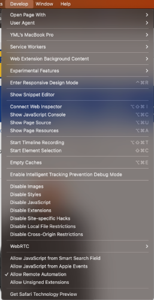
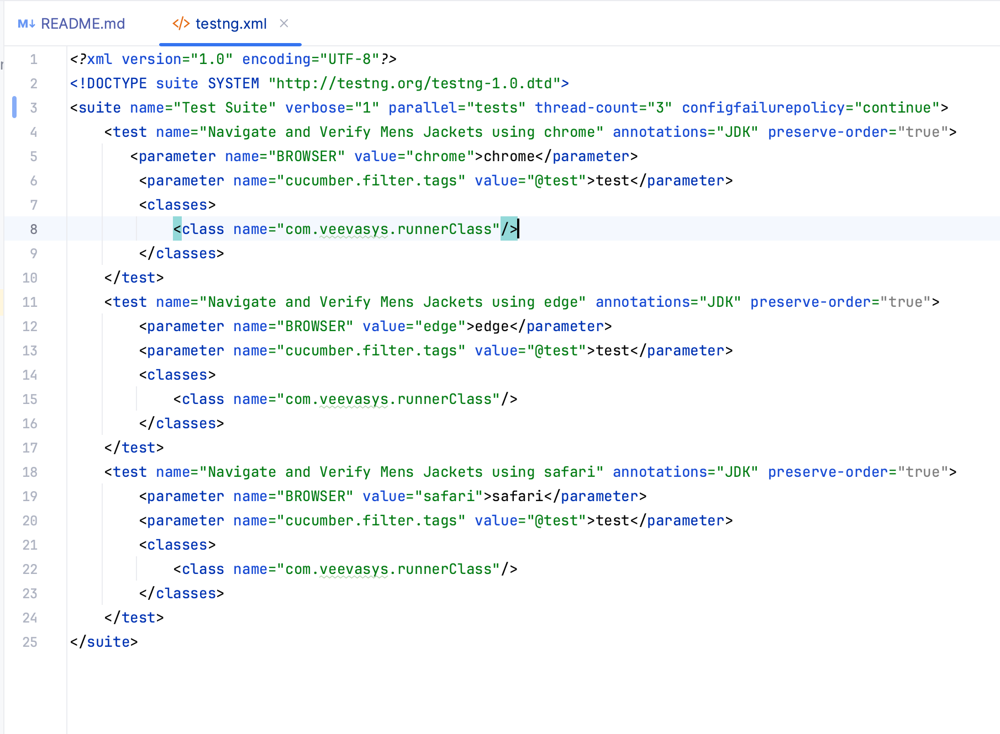
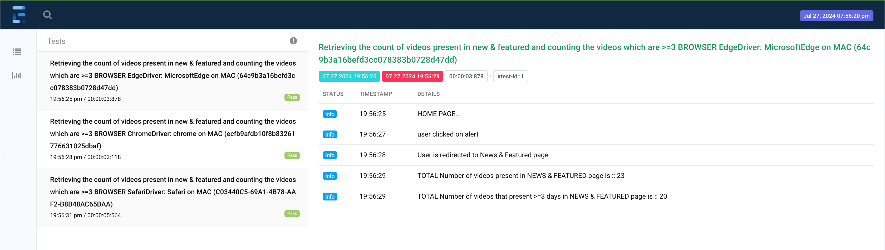

Introduction: 
---------------

This Test Automation Framework is created using Java + Selenium Web Driver + TestNG + Cucumber. Which can be used across different web based applications. In this approach, the endeavor is to build a lot of applications independent reusable components so that they can directly used for another web application/modules without spending any extra effort. With this framework in place, whenever we need to automate a web based application/module, we would not need to start from scratch, but use the application independent components to the extent possible and create application specific components for the specific needs. 

Prerequisites:
---------------
* Java jdk-1.8 or higher
* Apache Maven 3 or higher
* IntelliJ/Ec IDE
* Required IntelliJ Plugins:
    * Maven
    * Cucumber
    * Git

Environment:
---------------
* 	Currently Environment is pointing to CP, DP1 & DP2 but in future this can be pointed to real environments with minor tweaks

## Browser

#### **_Browsers binaries are used for setting up browsers through WebDriverManager dependency._**

CHROME, EDGE and SAFARI browsers related code is implemented and validated.
FIREFOX, IE code is implemented but not validated due to some unavoidable circumstances.

### **NOTE**: 
To run the test cases in SAFARI, do enable **Allow Remote Automation** in SAFARI as shown in below.
Goto Safari browser --> Develop --> click Allow Remote Automation if it is not already selected.

Execution:
---------------
*	Clone the repository.
*	Open command prompt and go to automation-assessment folder.
*	To run on local environment use below commands ....

<B>To Run all the test cases from all the modules:</B> 
automation-assessment> <B>mvn clean test</B> \\This command will run all the test cases from all the modules 
 <B>To Run specific module test cases from parent module:</B> 
automation-assessment> <B>mvn clean test -pl</B> <module_name> 
 <B>To Run specific module test cases from its own module:</B> 
1. Module_name % <B>mvn clean test</B>
 2. Go to testng.xml --> run

<B><I>REMOTE is not included. Current code is feasible to include the Remote if necessary in future</B></I>

### **Note:** Browser and Environment are parameterized in testng.xml

**Default browser will be chrome** 

## Parallel Execution
**Currently framework supports parallel execution. **
 To run the test cases in different browsers parallel for a particular module, do changes in testng as below screenshot.

## Adding new MODULE to the framework:

Follow below commands to add new module:

mvn archetype:generate -DgroupId=**com.veevasys** -DartifactId=**Provide_Module_Name**

Once Module is created, add below code to pom.xml

**In Parent pom.xml(i.e., automation-assessment) add new module details under` <module>` section**
ex:
 `<modules>
  <module>module_name</module>
</modules>`

**In new module pom.xml, add below parent dependency** 
`<parent>
<artifactId>automation-assessment</artifactId>
<groupId>com.veevasys</groupId>
<version>1.0-SNAPSHOT</version>
</parent>`

<a href="https://github.com/shirishk/Java-Selenium-TestNG-Automation-Framework/wiki/Logging"><h2>Logging:</h2></a>

*	log4j configured to capture the test execution logs
*	Configuration file is located at src/main/resources/log4j.properties
*	Execution log is captured in the logs/FrameWork.log in each module

Screenshot:
---------------
*	Most of the time we think to Capture Screenshot in WebDriver when some kind of error or exception surfaces while practicing testing, to resolve the same the framework has a method.
*	captureScreenshot() is used to indicates driver to capture a screenshot and store it in //ExportData directory.
*   Screenshot can be disabled through the framework property file. Go to test-properties.yaml --> change screenshots to false under webDriverConfig.
*   Default value will be true for this variable.

Reporting:
---------------
*  Currently, framework supports very basic ExtentSparkReporter report. This will be improved in future for making rich GUI and Client/end-user satisfactory

## FUTURE ENHANCEMENTS
* Improving the report quality
* supporting remote execution
* Including the retry functionality using testng listeners
* Firefox and IE and other browsers need to include.
* Improving quality of the exceptions
* Database integration(Oracle & MongoDB)
* CI/CD integration